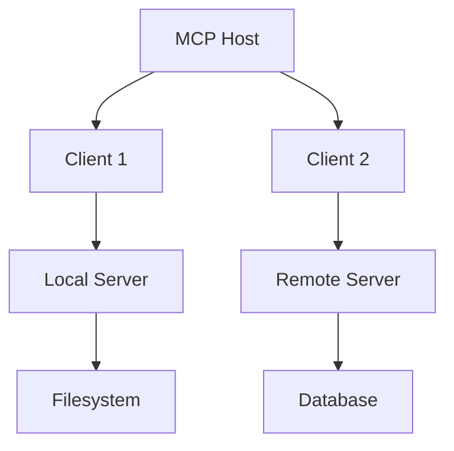
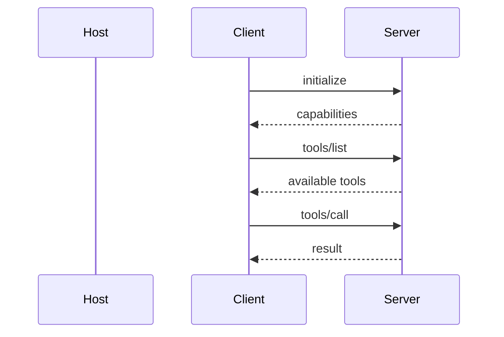
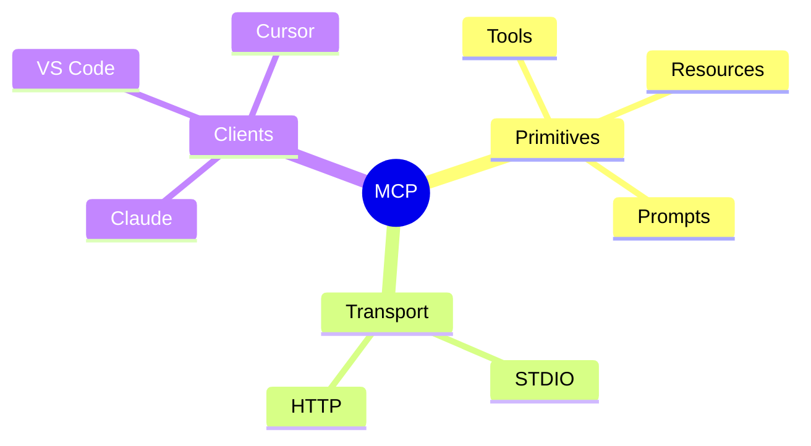

# MCP Architecture Deep Dive

**Mode:** Pro
**Theme:** Obsidian
**Length:** 6 slides

**Library requirements:** Mermaid.js v11.13.0 (ESM import)
**Read references/libraries.md before generating — follow Mermaid section exactly.**

---

## Slide 1 — Title
**Title:** Model Context Protocol
**Subtitle:** Architecture deep dive
**Tag:** MCP

## Slide 2 — Mermaid Flowchart (TD)
**Tag:** Architecture
**Heading:** Client-Server Connection Flow

Requirements:
- Wrap in `
` with background, border, border-radius
- Use flowchart TD (not LR)
- Max 8 nodes
- themeVariables matching Obsidian palette
- fontSize: '18px'
- Include diagram lightbox with +/- zoom buttons

## Slide 3 — Mermaid Sequence Diagram
**Tag:** Protocol
**Heading:** Tool Call Lifecycle

Same container requirements as Slide 2.

## Slide 4 — Mermaid Mind Map
**Tag:** Ecosystem
**Heading:** MCP Components

Same container requirements.

## Slide 5 — Content Slide (no Mermaid)
**Tag:** Primitives
**Heading:** Three Building Blocks

Explain Tools, Resources, Prompts as three cards or sections (use component templates).

## Slide 6 — CTA
**Heading:** Get Started with MCP
**Resources:**
- Spec: modelcontextprotocol.io
- SDKs: TypeScript, Python, Java, C#
- Servers: github.com/modelcontextprotocol/servers
